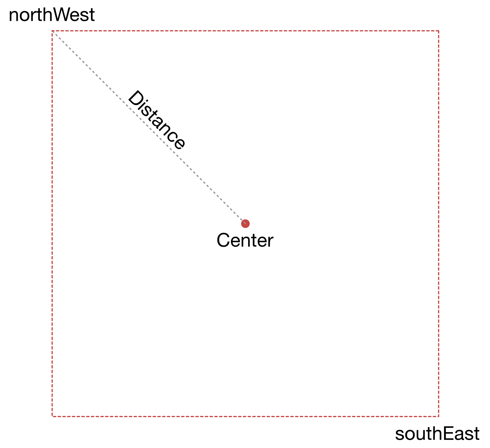

# Bounds

Bounds describe an area which is defined by its north-eastern and south-western points.

All of *phpgeo's* geometries except for the `Coordindate` class provide a `getBounds()` method via the `GetBoundsTrait`.

The `Bounds` class has a method to calculate the center point of the bounds object (works correctly for bounds that cross the dateline at 180/-180 degrees longitude too).

## Create Bounds for a given center point and distance to the corners

``` php
<?php

use Location\Factory\BoundsFactory;
use Location\Coordinate;

$bounds = BoundsFactory::expandFromCenterCoordinate(
    new Coordinate(52, 13),
    1000,
    new BearingSpherical()
);
```

The following image illustrates how the bounds (dashed line in red) are created:


