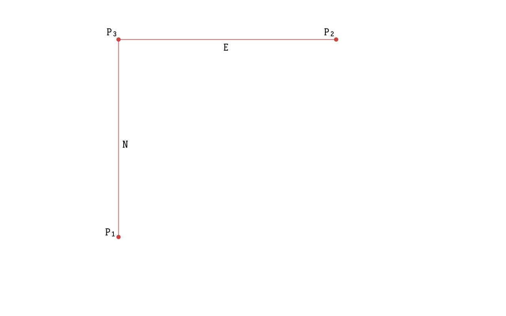

# Cardinal Distance Between Two Points

The distances how far you have to go to one cardinal direction and eventually to another to reach the second point
*P<sub>2</sub>* from the first one *P<sub>1</sub>* is called the Cardinal Distances.

In the following example the Cardinal Distances are labeled *N* and *E:*



[TOC]

With *phpgeo* there are two ways to calculate the Cardinal Distances:

## Using the Calculator Instance

```php
<?php

use Location\Coordinate;
use Location\Distance\Vincenty;
use Location\CardinalDirection\CardinalDirectionDistancesCalculator;

$coordinate1 = new Coordinate(19.820664, -155.468066); // Mauna Kea Summit
$coordinate2 = new Coordinate(20.709722, -156.253333); // Haleakala Summit

$calculator = new Vincenty();
$cardinalDirectionDistancesCalculator = new CardinalDirectionDistancesCalculator();

$result = $cardinalDirectionDistancesCalculator->getCardinalDirectionDistances($coordinate1, $coordinate2, $calculator);

echo 'Cardinal Distances: north=' . $result->getNorth()
. ' m; east=' . $result->getEast()
. ' m; south=' . $result->getSouth(
. ' m; west=' . $result->getWest() . ' m.';
```

The code above will produce the following output:

```
Cardinal Distances: north=98425.507 m; east=0 m; south=0 m; west=82268.492 m.
```

## Using the `getCardinalDirectionDistances()` method of a Coordinate instance

```php
<?php

use Location\CardinalDirection\CardinalDirection;
use Location\Coordinate;
use Location\Distance\Vincenty;

$point1 = new Coordinate(52.5072, 13.4248); // Berlin, Germany
$point2 = new Coordinate(52.4284, 13.0276); // Potsdam, Germany

$direction = (new CardinalDirection())->getCardinalDirection($point1, $point2);

$result = $point1->getCardinalDirectionDistances($point2, new Vincenty());

echo 'Cardinal Distances: direction=' . $direction
    . '; north=' . $result->getNorth()
    . ' m; east=' . $result->getEast()
    . ' m; south=' . $result->getSouth()
    . ' m; west=' . $result->getWest() . ' m.';
```

The code above will produce the following output:

```
Cardinal Distances: direction=north-east; north=0 m; east=0 m; south=8768.566 m; west=26969.504 m.
```
