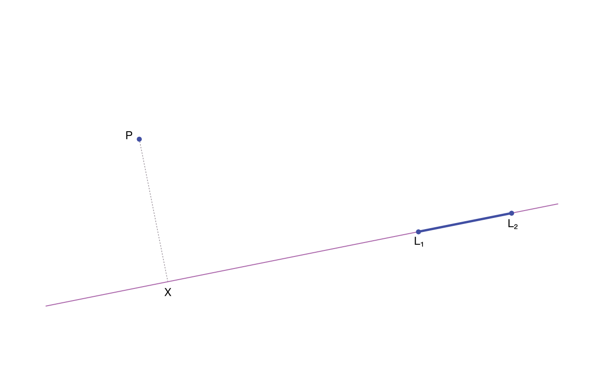

# Perpendicular Distance

The _perpendicular distance_ is defined as the shortest distance between a point
a line (in the two-dimensional plane) respectively between a point and a
[great circle](https://en.wikipedia.org/wiki/Great_circle) on a spherical surface.

With _phpgeo_ it is possible to calculate the perpendicular distance between a
point (instance of the [`Point`](../Geometries/Point) class) and a
Great Circle - which is defined by a [`Line`](../Geometries/Line). A line is
defined by a pair of coordinates.

The distance between points *P* and *X* is the perpendicular distance in the following sketch:



## Example

``` php
<?php

use Location\Point;
use Location\Line;
use Location\Utility\PerpendicularDistance;

$point = new Point(52.44468, 13.57455);
$line = new Line(
    new Point(52.4554, 13.5582),
    new Point(52.4371, 13.5623)
);

$pdCalc = new PerpendicularDistance();

printf(
    "perpendicular distance: %.1f meters\n",
    $pdCalc->getPerpendicularDistance($point, $line)
);
```

The code above will produce the output below:

``` plaintext
perpendicular distance: 936.7 meters
```
