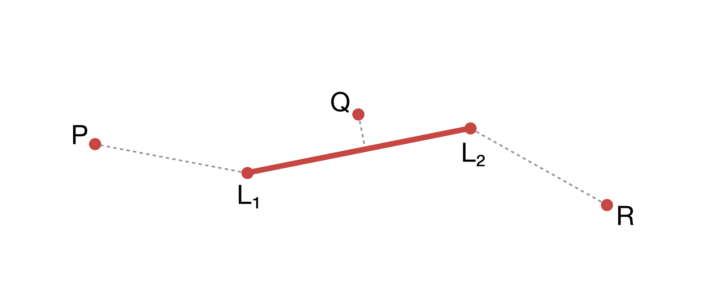

# Distance Between a Point and a Line

It's possible to calculate the shortest distance between a point and a
[`Line`](../Geometries/Line). As [`Polyline`](../Geometries/Polyline)
and [`Polygon`](../Geometries/Polygon) are also built upon the `Line` class
it's also possible to calculate distances from a point the polyline/polygon
by iterating over their segments.

The following image explains how the distance is calcualated: *P* and *R* are
located in such a way that the nearest distance to the line is the distance between
*P*, *R* and the line end points. Point *Q* is nearer to the actual line than to
any of the end points, so the actual distance is the perpendicular distance between *Q*
and the line.



## Example

``` php
<?php

use Location\Coordinate;
use Location\Distance\Vincenty;
use Location\Line;
use Location\Utility\PointToLineDistance;

$point = new Coordinate(52.5, 13.5);
$line = new Line(
    new Coordinate(52.5, 13.1),
    new Coordinate(52.5, 13.1)
);

$pointToLineDistanceCalculator = new PointToLineDistance(new Vincenty());

printf(
    'Distance from point to line: %.1f meters%s',
    $pointToLineDistanceCalculator->getDistance($point, $line),
    PHP_EOL
);
```

The code above will produce the output below:

``` plaintext
Distance from point to line: 27164.1 meters
```
