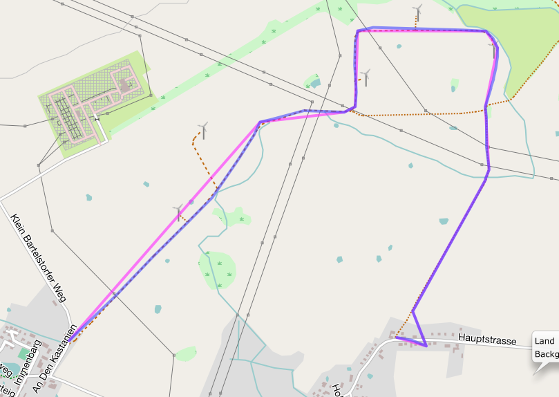

# Simplifying a polyline/polygon

[TOC]

Polylines and polygons can be simplified to save storage space or bandwidth.

_phpgeo_ provides two implementations for simplifying polyline/polygons.

The first implementation uses the [_Ramer–Douglas–Peucker algorithm_](https://en.wikipedia.org/wiki/Ramer–Douglas–Peucker_algorithm)
(also known as _Douglas-Peucker algorithm_). The other implementation examines
the bearings of the segments and removes a segment when its bearing
angle is similar to the bearing angle of its predecessor segment. I named it
the _Delta-Bearing algorithm_.

## Ramer-Douglas-Peucker Algorithm

``` php
<?php

use Location\Coordinate;
use Location\Formatter\Coordinate\DecimalDegrees;
use Location\Polyline;
use Location\Processor\Polyline\SimplifyDouglasPeucker;

$polyline = new Polyline();
$polyline->addPoint(new Coordinate(10.0, 10.0));
$polyline->addPoint(new Coordinate(20.0, 20.0));
$polyline->addPoint(new Coordinate(30.0, 10.0));

$processor = new SimplifyDouglasPeucker(1500000);

$simplified = $processor->simplify($polyline);

foreach ($simplified->getPoints() as $point) {
    echo $point->format(new DecimalDegrees()) . PHP_EOL;
}
```

The example code will remove all points which perpendicular distance is less
than 1,500,000 meters (1,500 km) from the surrounding points.

The code above produces the output below:

``` plaintext
10.00000 10.00000
30.00000 10.00000
```

## Delta-Bearing Algorithm

``` php
<?php

use Location\Coordinate;
use Location\Formatter\Coordinate\DecimalDegrees;
use Location\Polyline;
use Location\Processor\Polyline\SimplifyBearing;

$polyline = new Polyline();
$polyline->addPoint(new Coordinate(10.0, 10.0));
$polyline->addPoint(new Coordinate(20.0, 20.0));
$polyline->addPoint(new Coordinate(30.0, 10.0));

$processor = new SimplifyBearing(90);

$simplified = $processor->simplify($polyline);

foreach ($simplified->getPoints() as $point) {
    echo $point->format(new DecimalDegrees()) . PHP_EOL;
}
```

The constructor argument for the `SimplifyBearing` class is the minimum
required angle in degrees between two adjacent polyline segments so that
no points will be removed. If the bearing angle difference is less that
the given value, the middle point will be removed from the resulting
polyline.

The code above produces the output below:

``` plaintext
10.00000 10.00000
30.00000 10.00000
```

The following image shows both a polyline and its simplified version. The
simplification was done with the Delta-Bearing Algorithm with a threshold angle
of 20 degrees. The original polyline is painted in blue, the simplified polyline
is magenta.


